# 自动调价系统流程图

## 系统架构概览

自动调价系统分为四个主要阶段：
1. **数据接收阶段** - 接收EIP推送的亚马逊价格数据
2. **价格对比推送阶段** - 将待对比的价格数据推送到各平台队列
3. **价格对比处理阶段** - 消费队列消息，对比价格并生成调价日志
4. **价格更新执行阶段** - 处理调价日志，执行价格更新并校验

---

## 详细流程图

```mermaid
graph TB
    Start([开始]) --> EIP[EIP系统推送亚马逊价格变化]
    
    %% 阶段1: 数据接收
    EIP --> Queue1[RabbitMQ队列<br/>rabbitmq_amazon_price_change_notice]
    Queue1 --> Consumer1[EipAmazonPriceDataConsumer<br/>消费队列消息]
    Consumer1 --> Validate1{验证数据格式}
    Validate1 -->|失败| LogError1[记录错误日志<br/>确认消息避免重试]
    Validate1 -->|成功| FormatData[格式化数据<br/>AmazonPriceReferenceService::formatData]
    FormatData --> SaveDB[(写入amazon_price_reference表<br/>contrast_status=0 待对比)]
    SaveDB --> End1[阶段1完成]
    
    %% 阶段2: 价格对比推送
    End1 --> Schedule1[定时任务<br/>PushAmazonPriceCompareCommand]
    Schedule1 --> QueryConfig[查询所有启用的调价配置<br/>AutoAdjustPriceConfig status=1]
    QueryConfig --> GroupBySite[按站点+币种分组配置]
    GroupBySite --> LoopSite{遍历每个站点+币种组合}
    
    LoopSite --> QueryPending[查询待对比数据<br/>amazon_price_reference<br/>contrast_status=0]
    QueryPending --> ChunkData[分批处理<br/>默认100条/批]
    ChunkData --> UpdateStatus[更新状态为已对比<br/>contrast_status=1]
    UpdateStatus --> BuildMsg[构建消息<br/>包含amazon_price_ids/config_id等]
    BuildMsg --> PushQueue{推送到各平台队列}
    
    PushQueue --> QueueShopify[Shopify队列<br/>rabbitmq_amazon_price_compare_shopify]
    PushQueue --> QueueWalmart[Walmart队列<br/>rabbitmq_amazon_price_compare_walmart]
    PushQueue --> QueueTiktok[Tiktok队列<br/>rabbitmq_amazon_price_compare_tiktok]
    
    PushQueue -->|全部失败| Rollback[回退状态<br/>contrast_status=0]
    Rollback --> LoopSite
    PushQueue -->|部分成功| LoopSite
    
    %% 阶段3: 价格对比处理
    QueueShopify --> ConsumerShopify[AutoAdjustPriceCommand<br/>Shopify消费者]
    QueueWalmart --> ConsumerWalmart[AutoAdjustPriceCommand<br/>Walmart消费者]
    QueueTiktok --> ConsumerTiktok[AutoAdjustPriceCommand<br/>Tiktok消费者]
    
    ConsumerShopify --> ParseMsg[解析消息<br/>验证必要字段]
    ConsumerWalmart --> ParseMsg
    ConsumerTiktok --> ParseMsg
    
    ParseMsg --> GetConfig[获取调价配置<br/>AutoAdjustPriceConfig]
    GetConfig --> GetAmazonPrice[获取Amazon价格数据<br/>AmazonPriceReference]
    GetAmazonPrice --> SyncPrice[同步Listing最新价格<br/>调用平台API]
    
    SyncPrice --> ComparePrice[对比价格逻辑<br/>AutoAdjustPriceService::autoAdjustPrice]
    ComparePrice --> CheckWhitelist{检查白名单}
    CheckWhitelist -->|在白名单| LogSkip[记录日志<br/>status=NO_PROCESS<br/>reason=白名单]
    CheckWhitelist -->|不在白名单| ShouldAdjust[判断是否需要调价<br/>shouldAdjustPrice方法]
    
    ShouldAdjust --> CalcDiff[计算价格差<br/>listing_price - amazon_price]
    CalcDiff --> CheckIncrease{价格差 < 0?<br/>需要涨价}
    CheckIncrease -->|是| CalcIncreaseRatio[计算涨价比例<br/>abs差值/amazon_price * 100]
    CalcIncreaseRatio --> CheckIncreaseLimit{涨价比例<br/>< 设置的比例?}
    CheckIncreaseLimit -->|是| CheckOffset{amazon_price +<br/>increase_offset ==<br/>listing_price?}
    CheckOffset -->|是| NoAdjust1[无需调价<br/>reason=价格已等于目标价格]
    CheckOffset -->|否| NeedIncrease[需要涨价<br/>new_price = amazon_price + increase_offset]
    
    CheckIncreaseLimit -->|否| NoAdjust2[无需调价<br/>reason=涨价比例已达到设置值]
    
    CheckIncrease -->|否| CheckDecrease{价格差 > 0?<br/>需要降价}
    CheckDecrease -->|是| CalcDecreaseRatio[计算降价比例<br/>差值/listing_price * 100]
    CalcDecreaseRatio --> CheckDecreaseLimit{降价比例<br/>> 设置的比例?}
    CheckDecreaseLimit -->|是| NeedDecrease[需要降价<br/>new_price = listing_price - decrease_offset]
    CheckDecreaseLimit -->|否| NoAdjust3[无需调价<br/>reason=降价比例未达到设置值]
    
    CheckDecrease -->|否| NoAdjust4[无需调价<br/>reason=价格一致]
    
    NeedIncrease --> LogPending[生成调价日志<br/>status=PENDING<br/>写入auto_adjust_price_logs表]
    NeedDecrease --> LogPending
    NoAdjust1 --> LogNoProcess[生成日志<br/>status=NO_PROCESS<br/>记录原因]
    NoAdjust2 --> LogNoProcess
    NoAdjust3 --> LogNoProcess
    NoAdjust4 --> LogNoProcess
    LogSkip --> LogNoProcess
    
    LogPending --> AckMsg[确认消息<br/>basic_ack]
    LogNoProcess --> AckMsg
    AckMsg --> End3[阶段3完成]
    
    %% 阶段4: 价格更新执行
    End3 --> Schedule2[定时任务<br/>ProcessAutoAdjustPriceLogsCommand]
    Schedule2 --> QueryLogs[查询待处理日志<br/>auto_adjust_price_logs<br/>status=PENDING]
    QueryLogs --> GroupByAccount[按账号分组]
    GroupByAccount --> GroupBySku[按sku_id+product_id+<br/>seller_sku分组去重]
    
    GroupBySku --> CheckDuplicate{同一SKU<br/>多条日志?}
    CheckDuplicate -->|是| SortByTime[按price_time降序排序<br/>只处理最新的]
    SortByTime --> ProcessLatest[处理最新日志]
    SortByTime --> MarkSkip[标记其他日志为跳过<br/>status=NO_PROCESS<br/>reason=存在更新的价格数据]
    
    CheckDuplicate -->|否| ProcessSingle[处理单条日志]
    ProcessLatest --> UpdatePrice[调用平台服务<br/>updatePrice方法<br/>更新平台价格]
    ProcessSingle --> UpdatePrice
    
    UpdatePrice --> UpdateSuccess{更新成功?}
    UpdateSuccess -->|成功| LogSuccess[更新日志状态<br/>status=SUCCESS<br/>price_updated_at=当前时间]
    UpdateSuccess -->|失败| LogFailed[更新日志状态<br/>status=FAILED<br/>记录失败原因]
    
    LogSuccess --> VerifyPrice[校验价格<br/>updateListingPriceAndVerifyPrice<br/>调用平台API获取最新价格]
    VerifyPrice --> VerifySuccess{校验成功?<br/>new_price == 实际价格}
    VerifySuccess -->|成功| LogVerifySuccess[更新校验状态<br/>verify_status=VERIFY_SUCCESS]
    VerifySuccess -->|失败| LogVerifyFailed[更新校验状态<br/>verify_status=VERIFY_FAILED<br/>记录失败原因]
    
    LogVerifySuccess --> ProgressBar[更新进度条]
    LogVerifyFailed --> ProgressBar
    LogFailed --> ProgressBar
    MarkSkip --> ProgressBar
    
    ProgressBar --> MoreLogs{还有更多日志?}
    MoreLogs -->|是| GroupBySku
    MoreLogs -->|否| SendNotify[发送微信通知<br/>处理结果统计]
    SendNotify --> End4([结束])
    
    style Start fill:#e1f5ff
    style End4 fill:#e1f5ff
    style SaveDB fill:#fff4e1
    style LogPending fill:#fff4e1
    style UpdatePrice fill:#e8f5e9
    style LogSuccess fill:#e8f5e9
    style LogVerifySuccess fill:#e8f5e9
    style LogError1 fill:#ffebee
    style LogFailed fill:#ffebee
    style LogVerifyFailed fill:#ffebee
```

---

## 核心业务逻辑说明

### 1. 调价判断逻辑 (shouldAdjustPrice)

**涨价场景**：
- 当 `listing_price < amazon_price` 时，需要判断是否涨价
- 计算涨价比例：`abs(listing_price - amazon_price) / amazon_price * 100`
- 如果涨价比例 < 设置的涨价比例：
  - 检查：`amazon_price + increase_offset == listing_price`
  - 如果相等：无需调价（价格已等于目标价格）
  - 如果不相等：需要调价，新价格 = `amazon_price + increase_offset`
- 如果涨价比例 >= 设置的涨价比例：无需调价（已达到设置值）

**降价场景**：
- 当 `listing_price > amazon_price` 时，需要判断是否降价
- 计算降价比例：`(listing_price - amazon_price) / listing_price * 100`
- 如果降价比例 >= 设置的降价比例：无需调价（已达到设置值）
- 如果降价比例 < 设置的降价比例：
  - 检查：`amazon_price + decrease_offset == listing_price`
  - 如果相等：无需调价（价格已等于目标价格）
  - 如果不相等：需要调价，新价格 = `amazon_price + decrease_offset`

### 2. 配置参数说明

- **increase_ratio**: 涨价比例阈值（%）
- **increase_offset**: 涨价金额偏移量（涨价时附加的固定金额）
- **decrease_ratio**: 降价比例阈值（%）
- **decrease_offset**: 降价金额偏移量（降价时减少的固定金额）

### 3. 数据表说明

- **amazon_price_reference**: 亚马逊价格参考表
  - `contrast_status`: 0-待对比，1-已对比
  
- **auto_adjust_price_configs**: 自动调价配置表
  - `status`: 1-启用，0-禁用
  
- **auto_adjust_price_logs**: 自动调价日志表
  - `status`: 1-未处理(PENDING)，2-成功(SUCCESS)，3-失败(FAILED)，4-无需处理(NO_PROCESS)
  - `verify_status`: 0-无需校验，1-校验成功，2-校验失败

### 4. 去重策略

在 `ProcessAutoAdjustPriceLogsCommand` 中：
- 按账号分组
- 在每个账号下，按 `sku_id + product_id + seller_sku` 分组
- 如果同一SKU有多条日志，按 `price_time` 降序排序，只处理最新的
- 其他日志标记为 `NO_PROCESS`，原因：存在更新的价格数据

---

## 关键命令说明

1. **common:eip-amazon-price-data-consumer**
   - 消费EIP推送的亚马逊价格数据
   - 持续运行，监听队列消息

2. **common:push-amazon-price-compare**
   - 定时执行，推送待对比的价格数据到各平台队列
   - 参数：`--limit=100`（每次处理数量）

3. **common:auto-adjust-price**
   - 消费各平台的价格对比队列
   - 参数：`--platform_code=shopify/walmart/tiktok`
   - 持续运行，监听队列消息

4. **common:process-auto-adjust-logs**
   - 定时执行，处理待处理的调价日志
   - 参数：`--platform_code=shopify/walmart/tiktok`，`--limit=100`

---

## 异常处理机制

1. **数据验证失败**：记录错误日志，确认消息避免无限重试
2. **推送失败**：如果所有平台都推送失败，回退 `contrast_status` 为 0
3. **价格更新失败**：记录失败原因到日志表，状态设为 FAILED
4. **价格校验失败**：记录校验失败原因，状态设为 VERIFY_FAILED

---

## 性能优化点

1. **批量处理**：使用分批处理避免一次性加载大量数据
2. **连接复用**：RabbitMQ客户端实例缓存，复用连接
3. **去重策略**：按账号和SKU分组，避免重复处理
4. **状态更新**：使用事务和状态检查避免并发问题

